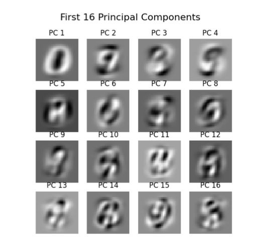
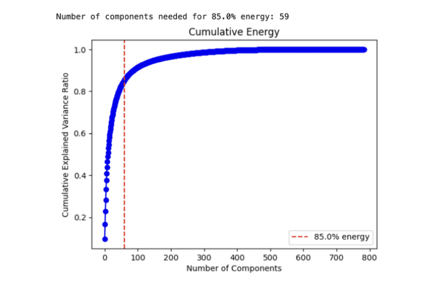
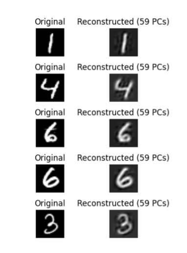
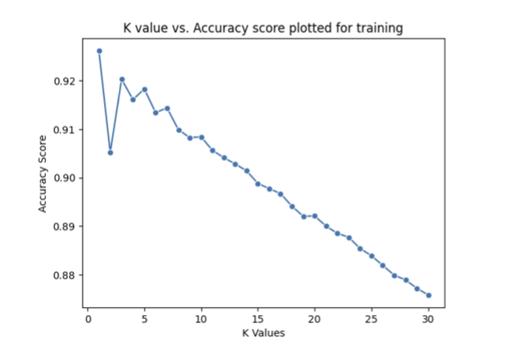
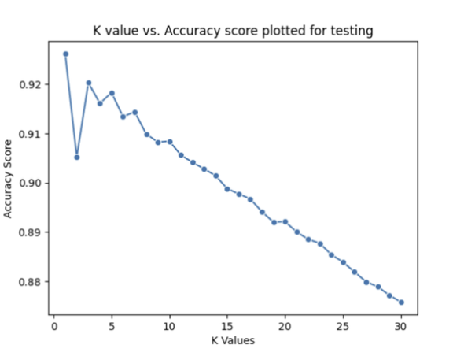
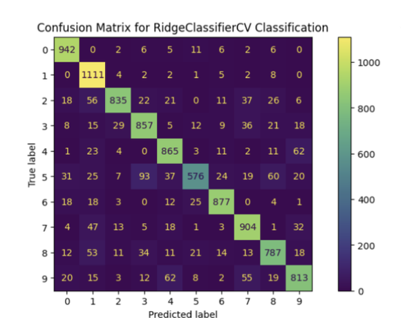
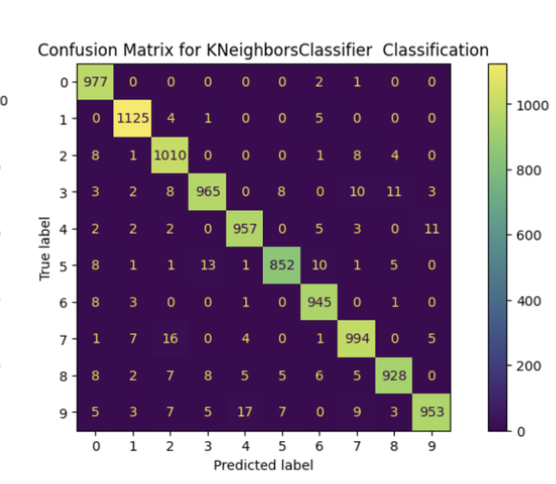
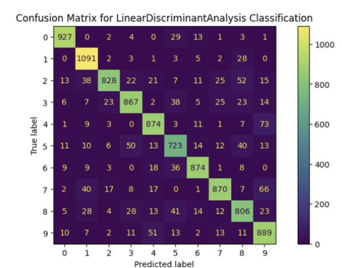

# MNIST-Digit-Classification-using-PCA-and-Classifiers

**Author:** Kutay Demiralay  
**Department of Aeronautics and Astronautics, University of Washington, Seattle, WA**

## Overview

This project focuses on building and evaluating classifiers to recognize handwritten digits from the **MNIST dataset**, using **Principal Component Analysis (PCA)** for dimensionality reduction and applying **Ridge Regression**, **K-Nearest Neighbors (KNN)**, and **Linear Discriminant Analysis (LDA)** classifiers.

The MNIST dataset includes:
- 60,000 training samples
- 10,000 test samples
- Each image: 28×28 pixels (784 features)

## Theoretical Background

- **PCA**: Reduces dimensionality by projecting data onto directions of maximum variance, obtained via **Singular Value Decomposition (SVD)**.
- **Ridge Regression**: Regularized linear regression minimizing squared error with an L2 penalty.
- **KNN**: Classifies based on majority class among k-nearest neighbors in feature space.
- **LDA**: Projects data to maximize class separation assuming Gaussian-distributed features.
- **Cross-validation**: Used to tune hyperparameters and assess generalization performance.

## Algorithm Steps

### Step 1: Data Preparation

- Flatten 28×28 images into 784-length vectors.
- Stack vectors into matrices `Xtrain` and `Xtest`.
- Labels stored in `ytrain` and `ytest`.

### Step 2: PCA Analysis

- Apply PCA using `sklearn.decomposition.PCA`.
- Visualize the **first 16 PCA modes** as 28×28 images.

### Step 3: Cumulative Energy Inspection

- Plot cumulative energy vs. number of PCA modes.
- Determine **k = 59** to capture 85% of variance.

### Step 4: Reconstruct Images from k-PCA

- Reconstruct 5 sample images using 59 PCA modes.
- Compare original vs. reconstructed digit images.

### Step 5: Digit Subset Selection

- Create subsets of digit pairs like (1,8), (2,7), (3,8).
- Generate new training and test sets for each subset.

### Step 6–8: Classifier Training

- **Ridge Classifier** with cross-validation (`cv=5`)
- **KNN Classifier**: Tune `k` using accuracy vs. k plot
- **LDA Classifier**: Trained on same PCA-projected data

## Figures

**Figure 1:** First 16 PCA modes (28×28 images)  

**Figure 2:** Cumulative Energy vs. Number of PCA Modes  

**Figure 3:** Original vs. Reconstructed Images (k=59)  

**Figure 4:** K vs. Accuracy (Training) – KNN  

**Figure 5:** K vs. Accuracy (Testing) – KNN  

**Figure 6:** Ridge Confusion Matrix  

**Figure 7:** KNN Confusion Matrix  

**Figure 8:** LDA Confusion Matrix  

## Results and Discussion

- **k = 59** PCA modes sufficient to reconstruct digits and preserve variance.
- **KNN** yielded the highest accuracy (96.15% train, 92.62% test) but showed signs of **overfitting**.
- **Ridge** and **LDA** provided more consistent train-test accuracy, with lower variance and better generalization.
- Classifiers struggled most with **similar digits (3 and 8)** and performed best on **distinct digits (2 and 7)**.
- Confusion matrices confirmed KNN's better overall performance but also its susceptibility to inconsistent generalization.

## Accuracy Summary

| Classifier | Train Accuracy | Test Accuracy | Std. Dev. Train | Std. Dev. Test | Overfit Risk |
|------------|----------------|---------------|------------------|----------------|---------------|
| Ridge      | 84.4%          | 84.2%         | 0.96%            | 3.05%          | Low           |
| KNN (k=1)  | **96.1%**      | **92.6%**     | 0.19%            | 2.26%          | **High**      |
| LDA        | 86.5%          | 86.4%         | 0.86%            | 2.94%          | Low           |

## Summary and Conclusion

Using PCA-reduced MNIST digit data, I trained three classifiers and evaluated their performances. While **KNN achieved the highest accuracy**, it also exhibited the most **overfitting**. **Ridge and LDA** showed more consistent results across training and testing. PCA proved to be a powerful tool in compressing data without significant information loss.

## Full Report

The full PDF report is available in the repository: [report.pdf](./report.pdf)

## Acknowledgements

Thanks to Po, Shavey, and Emoji for helpful discussions. Special thanks to Professor Eli for lectures, office hours, and code examples.

## References

[1] Eli Shlizerman (2024). *582 KutzBook*. AMATH 582 Wi 24: Computational Methods for Data Analysis.
